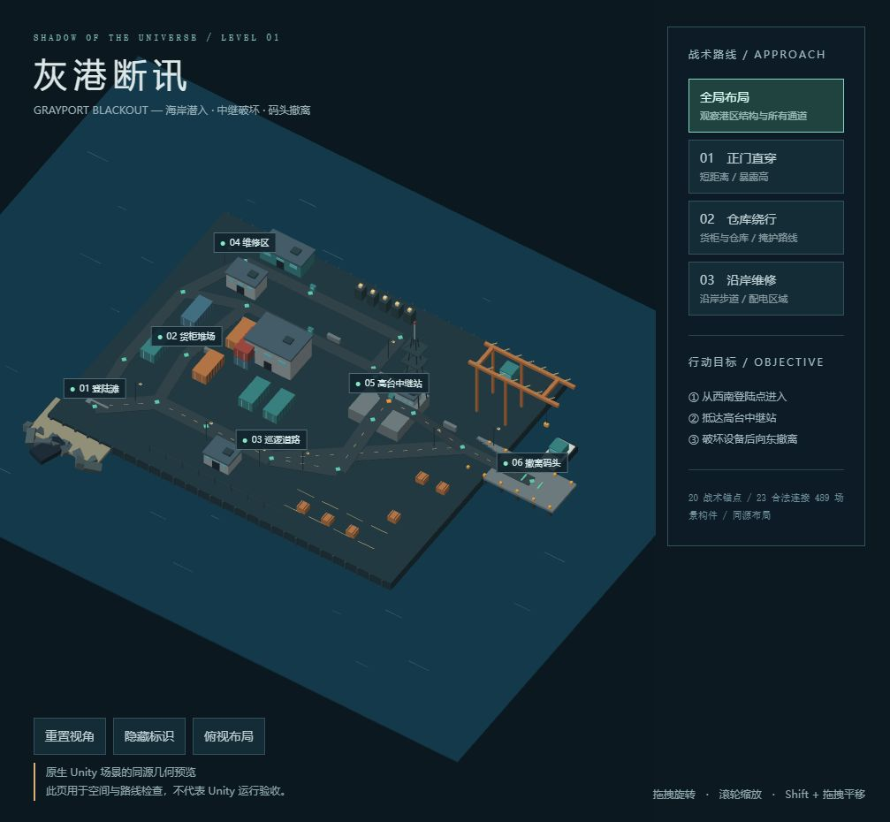

# Cosmic-Shadow · 宇宙之影

俯视战术原型：在短时任务中权衡路线、技能成功率、现实债务与撤离风险。

## 当前开发版本：V2 / 灰港断讯

港区样板关包含六个区域、20 个战术节点、23 条路线及 489 个场景对象，提供正门、仓库、沿岸三种接近方式，并加入巡逻、掩体、侦察终端、配电交互和目标完成后的撤离警戒。

- [关卡交付、操作与验证说明](docs/grayport/README.md)
- [V2 工程入口](UnityProjectV2/README.md)
- [关卡制作计划](docs/design-core/V2_LEVEL_PRODUCTION_PLAN.md)
- [策划内核](docs/design-core/README.md) · [工程规则](docs/design-core/V2_ENGINEERING_RULES.md)

用 Unity **6000.4.0f1** 打开 `UnityProjectV2/`，导入后打开 `Assets/_ProjectV2/Generated/Levels/Grayport/Grayport_Blackout.unity`。无需 Unity 的几何预览可直接打开 `docs/grayport/index.html`。

## 验证状态

已通过 114 项纯 C# 规则检查、资产引用与确定性重建检查，以及基于真实 Unity 托管程序集的外部编译检查。**Unity 原生导入、EditMode / PlayMode 和原生渲染尚待验收**：本机首次验证因缺少有效 Unity 许可证退出。浏览器预览和外部编译不代表游戏已通过实玩验收。

旧 `UnityProject/` 与历史设计资料保留，不与 V2 混用。
